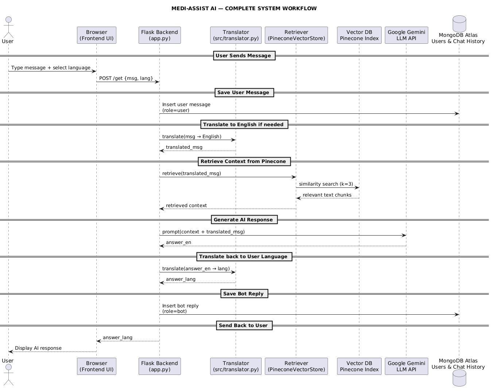

# Medi-Assist AI: Multilingual Medical Chatbot (Flask + LangChain + Gemini + Pinecone)

## Demo


Medi-Assist AI is a **multilingual medical chatbot** that provides safe, context-aware medical responses using **Retrieval Augmented Generation (RAG)**.  
It supports **English, Hindi, Tamil, and Telugu**, and integrates:

- Flask backend  
- LangChain RAG  
- Pinecone vector search  
- HuggingFace multilingual embeddings  
- Gemini 1.5 Flash  
- MongoDB Atlas  
- Live Medical News API  

---

# Features

### AI + RAG
- Retrieves **medical knowledge** from PDFs + Wikipedia  
- Uses **Pinecone** for high-speed vector search  
- Uses **Gemini 1.5 Flash** as reasoning LLM  

### Multilingual Chat  
Supports: English, Hindi, Tamil, Telugu  

### Medical News  
- Fetches latest health news (NewsData.io)  
- Provides fallback news  

### Chat History  
- Persistent conversations  
- Load/Delete chat  
- MongoDB Atlas storage  

---


| Component | Technology |
|------------|-------------|
| **Backend Framework** | Flask (Python) |
| **LLM & RAG Orchestration** | LangChain |
| **Large Language Model (LLM)** | Gemini 2.0 Flash (via `langchain-google-genai`) |
| **Database** | MongoDB |
| **Vector Database** | Pinecone |
| **Embedding Model** | `sentence-transformers/all-MiniLM-L6-v2` (HuggingFace) |
| **Multilingual Support** | `deep-translator` |
| **Frontend** | HTML5, CSS3, jQuery, JavaScript |
| **News API** | NewsData.io |


---

# Setup Instructions

## 1 Clone the Repository
```bash
git clone https://github.com/your-repo-url/medical-chatbot.git
cd medical-chatbot
```

## 2 Create Virtual Environment
```bash
python -m venv venv
source venv/bin/activate
# or Windows:
venv\Scripts\activate
```

## 3 Install Dependencies
```bash
pip install -r requirements.txt
```

## 4 Add Environment Variables  
Create `.env`:

```
PINECONE_API_KEY="your_pine_cone_api_key"
GOOGLE_API_KEY="your_google_api_key"
NCBI_EMAIL="Your_NCBI_mail"             
NCBI_API_KEY="Your_NCBI_key"     
MONGO_URL = "your_mongo_url"
SECRET_KEY="your_secret_key"
NEWS_DATA_API_KEY="yours_news_api_key"
```

## 5 (Optional) Build Vector Index
```bash
python store_index.py
```

## 6 Run App
```bash
python app.py
```
By default, the app runs at:  
**http://127.0.0.1:5000/**

---

# Architecture (Clean & Simple)


---

# Workflow Diagram (User → AI → User)



---

## Frontend Features

- Dynamic Dark/Light Theme (auto + manual toggle)
- Smooth chat animations (typing effects, transitions, autoscroll)
- Responsive UI (mobile + desktop)
- Markdown-rendered messages (bold, lists, links, code blocks)
- Multilingual support
  - English (en)
  - Hindi (hi)
  - Tamil (ta)
  - Telugu (te)
- Scrollable conversation history panel
- Switch between conversations instantly
- Start new chat button
- Delete specific conversations
- Live Medical News Feed Panel (with fallback images & headlines)
- User-based session system (chat history isolated per user)

---

## Backend Features

- Secure Authentication System
  - Register (Bcrypt hashing)
  - Login (Session-based)
  - Logout
  - Duplicate email prevention

- AI-Powered RAG System
  - Pinecone vector search
  - HuggingFace multilingual embeddings
  - Google Gemini 1.5 Flash / 2.0 Flash
  - Context-aware medical answers
  - Short, concise, medically-safe responses

- Automatic Translation Pipeline
  - Detect user language
  - Translate → process in English → translate back
  - Works reliably for Indian languages

- MongoDB Atlas Storage
  - Chat history
  - Conversation titles
  - User accounts
  - Fast indexed queries

- Live Medical News API
  - Fetches latest Indian medical/health updates
  - Falls back to static news if API fails

- Graceful failure handling
  - AI fallback message
  - Database offline detection
  - Translation fallback logic
----

## Deployment Features
- Runs on Google Cloud Run
- Automatic build from GitHub
- Environment variables via Secret Manager
- Fully serverless + auto-scaling
- HTTPS enabled
- Stateless backend with persistent DB
---

## Example Workflow

1. User selects Telugu and asks: "డయాబెటిస్ లక్షణాలు ఏమిటి?"
2. Frontend sends → { msg: "...", lang: "te" } to /get
3. Backend translates Telugu → English → "What are the symptoms of diabetes?"
4. Pinecone performs semantic search → Retrieves top 3 relevant medical chunks
5. Gemini 2.0 Flash generates a safe medical answer → e.g. "The common symptoms of diabetes include increased thirst..."
6. Backend translates English → Telugu → "డయాబెటిస్ యొక్క ప్రధాన లక్షణాలు ఇవి..."
7. Message stored in MongoDB
  - user message
  - bot message
  - language
  - timestamp
8. Frontend displays formatted answer
  - With markdown
  - With animations
  - Auto-scroll
  - Theme-aware styling
9. News Panel refreshes live health headlines in chosen language

---

# Folder Structure

```
medical-chatbot/
│
├── app.py
├── store_index.py
├── requirements.txt
│
├── src/
│   ├── db.py
│   ├── helper.py
│   ├── translator.py
│   ├── medical_news.py
│
├── static/
│   ├── chat.js
│   ├── chat.css
│
├── templates/
│   ├── chat.html
│   ├── login.html
│   ├── register.html
│
└── data/ medical related pdfs
```

---

## 🧑‍💻 API Endpoints


| Endpoint                         | Method | Description                                                                  |
| -------------------------------- | ------ | ---------------------------------------------------------------------------- |
| `/`                              | GET    | Loads chat UI (requires login)                                               |
| `/get`                           | POST   | Accepts `{ msg, lang }`, runs translation → RAG → response, returns AI reply |
| `/register`                      | GET    | Loads registration page                                                      |
| `/register`                      | POST   | Creates a new user (name, email, password, age)                              |
| `/login`                         | GET    | Loads login page                                                             |
| `/login`                         | POST   | Authenticates user and starts session                                        |
| `/logout`                        | POST   | Logs out user and clears session                                             |
| `/conversations`                 | GET    | Returns list of user conversations (id, title, timestamp)                    |
| `/conversation/<conv_id>`        | GET    | Loads all messages of a specific conversation                                |
| `/conversation/delete/<conv_id>` | POST   | Deletes a specific conversation and all its messages                         |
| `/end_chat`                      | POST   | Starts a brand-new chat (creates new conversation ID)                        |
| `/news`                          | GET    | Fetches latest medical news (with fallback data)                             |


# 👨‍⚕️ Authors

Team RTX — Pondicherry University
- Kola Varun Chandra  
- Anabhyan S  
- Sri Gurubhaguvela D  

📧 Email: **kvarunchandra19@gmail.com**
